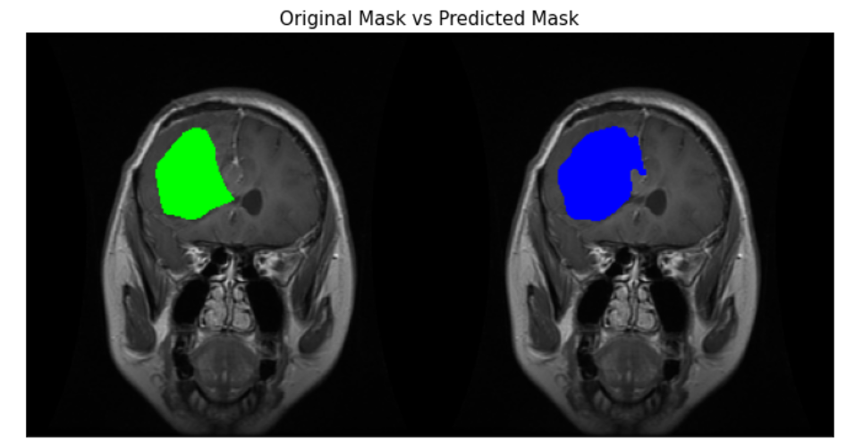
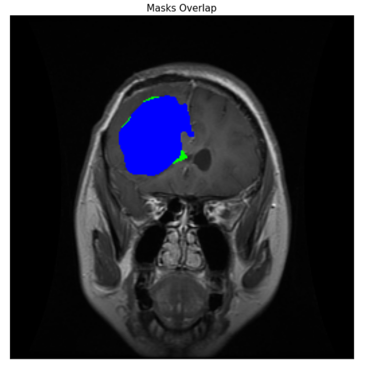

# Brain Tumor Segmentation using U-Net (MRI)

This project implements a **U-Net deep learning model** for **automatic brain tumor segmentation** on MRI scans.  
It uses the publicly available **Brain Tumor Segmentation** dataset from Kaggle and demonstrates:

- Data preprocessing
- U-Net architecture design
- Model training & validation
- Evaluation metrics
- Visual comparison (Original vs Prediction)
- Mask overlay visualization

Only **3 sample images** are included in this repository to show the dataset format.

---

## Dataset

This project uses the **Brain Tumor Segmentation** dataset:

https://www.kaggle.com/datasets/nikhilroxtomar/brain-tumor-segmentation

The full dataset includes MRI images and binary segmentation masks.  

or update the path in the notebook.

---

## Model Architecture

- **Model:** U-Net
- **Framework:** TensorFlow / Keras
- **Layers:**
  - Convolutional blocks
  - Max pooling
  - Transposed convolution
  - Skip connections
---

## Evaluation Metrics

Evaluation metrics are available in:

Metrics include:
- Precision
- Recall
- F1
- Jaccard

---

## Visual Results

###  Original vs Prediction

Example preview:

---

###  Overlay on MRI

Overlay visualizations are available in:

Example preview:

This highlights the tumor region directly on the MRI scan.

